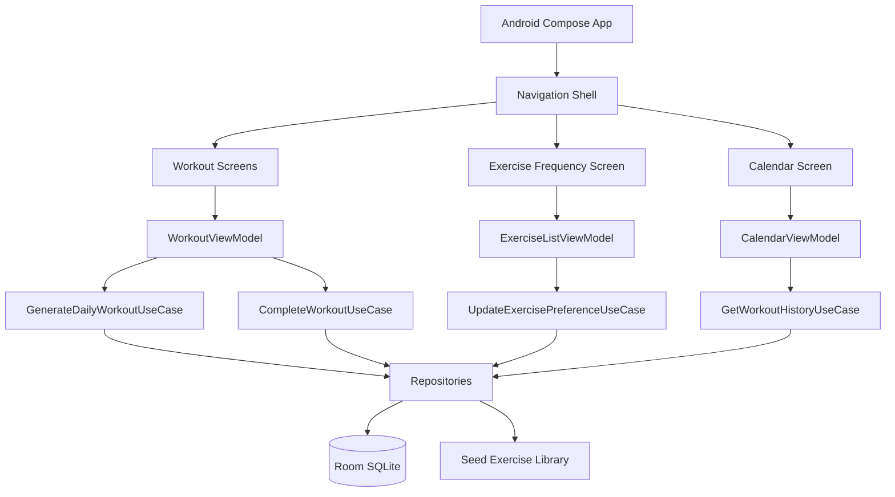

# WorkoutElite Architecture Plan

## Product Summary

WorkoutElite is an Android-first, Kotlin Multiplatform-ready workout app for local-only bodyweight workouts. It auto-generates one approximately 15-minute workout per local calendar day, **and lets a user start additional on-demand workouts within the same day if they want to keep training**. It adapts future workout difficulty from user feedback, persists workout history locally, and lets users tune how often each exercise appears.

Equipment is not required, except for optional jump-rope exercises.

## Confirmed Design Decisions

1. **Platform**: **Android only for v1** (decided). The architecture stays KMP-clean — `commonMain` avoids Android-only APIs and platform features (keep-screen-on, sound, haptics, UUID, active-session persistence hooks) go through `expect`/`actual` now — but iOS is **not** a shipping target in v1. The Gradle config should declare only the Android target until iOS is actively built/tested. iOS is a later milestone. See [Hidden Issues Register](#hidden-issues-register), item KMP.
2. **Timer behavior**: Pause/resume in app only. No background workout service in v1. Backgrounding the app **pauses** the workout in v1 (see Timer Rules). Timers are driven by a monotonic clock, not tick-counting. In-progress workout state is **persisted so it survives process death** (decided — see Timer Rules).
3. **Daily reset & multiple workouts**: Local calendar date, formatted `yyyy-MM-dd`, derived from `Clock.System.now().toLocalDateTime(TimeZone.currentSystemDefault()).date`. The app **auto-generates one workout per calendar date** on first open of that date. Beyond that, the user may **start additional on-demand workouts on the same day** — there is no one-per-day lock on manual starts. A completed workout inherits the `localDate` of the workout it belongs to, **not** the wall-clock date at completion, so a session started at 11:58pm counts toward the day it began. See Hidden Issues Register, items DATE and RACE.
4. **Workout format**: Mixed. Generator may use circuits, repeated exercises, or one-off exercises as needed.
5. **Exercise frequency**: Store as numeric `0..5`; show friendly labels to users.
6. **Difficulty adaptation**: Gradual rolling score, not a one-day-only adjustment.
7. **Exercise library**: Seed a large common bodyweight/jump-rope library with descriptions and workout-screen GIF demonstrations.

## Important Asset Constraint

The app should not hotlink random online GIFs. GIFs should be bundled or downloaded from sources with clear redistribution permission and attribution. If suitable licensed GIFs are unavailable, use simple app-owned vector/Compose animations or static illustrations until licensed assets are prepared.

Each exercise asset should track:

- source URL
- license
- attribution text
- local asset path

**Technical reality of GIFs in Compose Multiplatform:** Compose's `painterResource` / `Image` does **not** animate GIFs out of the box — a bundled GIF renders as a single static frame. Animated demos require either Coil 3 with its animated-image/GIF decoder, a Lottie renderer, or app-owned Compose vector animations. Pick the rendering approach before committing to the GIF format:

- Prefer **animated WebP** or **Lottie** over GIF for app size and quality; large looping GIFs bloat the bundle and are memory-heavy in a list.
- If using Coil 3, add the dependency and its animated-image decoder to the version catalog (not currently present) — otherwise Phase 6 will stall.
- Licenses such as CC-BY require visible attribution; add an in-app **Attributions** screen that lists each asset's `assetAttribution` and `assetLicense`. Tracking the fields is not enough on its own.

## Architecture

Use a single KMP Compose module at first. Keep clean package boundaries instead of creating many Gradle modules prematurely.

```text
composeApp/
├── src/commonMain/kotlin/com/workoutelite/
│   ├── domain/
│   │   ├── exercise/
│   │   ├── workout/
│   │   └── history/
│   ├── data/
│   │   ├── database/
│   │   ├── repository/
│   │   └── seed/
│   ├── presentation/
│   │   ├── workout/
│   │   ├── exercises/
│   │   └── calendar/
│   └── ui/
│       ├── components/
│       └── theme/
├── src/androidMain/
└── src/commonTest/
```

## Component Diagram



## Domain Model

### Exercise

Represents a possible movement.

Fields:

- `id: String`
- `name: String`
- `description: String`
- `category: ExerciseCategory`
- `movementPattern: MovementPattern`
- `difficulty: Int` from `1..5`
- `defaultDurationSeconds: Int`
- `isUnilateral: Boolean`
- `supportsJumpRope: Boolean`
- `demoAssetPath: String?`
- `assetSourceUrl: String?`
- `assetLicense: String?`
- `assetAttribution: String?`

### ExercisePreference

Fields:

- `exerciseId: String`
- `frequency: Int` from `0..5`

Labels:

```text
0 = None
1 = Rare
2 = Sometimes
3 = Normal
4 = Often
5 = Daily
```

### DailyWorkout

Fields:

- `id: String`
- `localDate: String`
- `sequence: Int` — `0` for the day's auto-generated workout; `1, 2, …` for user-initiated additional workouts that day. Combined with `localDate` this both preserves "exactly one auto workout per day" and allows on-demand extras.
- `origin: WorkoutOrigin` — `AUTO_DAILY` or `ON_DEMAND`. The auto workout (`sequence 0`) is `AUTO_DAILY`; extras are `ON_DEMAND`.
- `targetDifficultyScore: Double`
- `estimatedDurationSeconds: Int`
- `items: List<WorkoutItem>`
- `createdAtEpochMillis: Long`

Each generated workout snapshots `targetDifficultyScore` from the current `rollingScore` at its own generation time, so a second workout on the same day reflects any feedback already given on the first.

### WorkoutItem

Fields:

- `exerciseId: String`
- `order: Int`
- `workSeconds: Int` — **total** work time for this item, counting both sides for unilateral exercises. The halfway alert fires at `workSeconds / 2`. Duration math uses this total; do **not** double it elsewhere.
- `restAfterSeconds: Int`
- `isUnilateral: Boolean`

Rest defaults to 15 seconds between exercises but is stored **per item** in `restAfterSeconds`, which is the single source of truth. The rest screen reads this value; do not hardcode 15 in the UI. The last item in a workout has `restAfterSeconds = 0`.

### CompletedWorkout

Fields:

- `workoutId: String`
- `localDate: String`
- `completedAtEpochMillis: Long`
- `feedback: DifficultyFeedback`
- `durationSeconds: Int`

### DifficultyProfile

Fields:

- `rollingScore: Double`
- `updatedAtEpochMillis: Long`

Feedback mapping (concrete formula so behavior is testable):

- Initial `rollingScore` for a new user: `3.0` (cold start — no history).
- Easy: `rollingScore += 0.3`
- Medium: `rollingScore += 0.0` (unchanged)
- Hard: `rollingScore -= 0.3`
- Clamp to `1.0..5.0` **after** applying the delta.
- Missed days (no completion, no feedback): **no change** in v1 — the score neither decays nor advances. Revisit if users report the app feeling "stuck."

Granularity caveat: one Easy/Medium/Hard rating covers the whole ~15-minute session, not individual exercises. Accepted for v1; a per-exercise rating is a future enhancement.

`DailyWorkout.targetDifficultyScore` is a snapshot of `rollingScore` taken at generation time. The generator reads this snapshot; later feedback does not retroactively change an already-generated workout.

## Data Storage

Use Room SQLite locally.

Tables:

```text
exercises
exercise_preferences
weekly_or_global_difficulty_profile
daily_workouts
daily_workout_items
active_workout_sessions
completed_workouts
```

Schema/constraint requirements (prevents silent data bugs):

- `exercises` stores the seeded reference library with stable slug `id`, text, category/pattern, difficulty, duration, unilateral flag, equipment requirement, demo asset metadata, and `isActive`. It is reference data, but it lives in Room so preferences and history can join against it safely.
- `daily_workouts` has a **UNIQUE(`localDate`, `sequence`)** constraint (not `localDate` alone, since multiple workouts per day are allowed). The auto workout always targets `sequence = 0`, so this still guarantees exactly one auto-generated workout per date and defends against the check-then-generate race (see Hidden Issues Register, item RACE). On-demand workouts take the next free `sequence` for that date, allocated inside the same insert transaction.
- `daily_workout_items.workoutId` is a foreign key to `daily_workouts.id` with `ON DELETE CASCADE`, plus an index on `workoutId`.
- `completed_workouts.workoutId` is a foreign key to `daily_workouts.id`.
- `active_workout_sessions` stores at most one in-progress workout: `workoutId`, current item index, phase (`WORK`/`REST`), elapsed seconds in phase, paused flag, and updated timestamp. This is the source of truth for mid-workout restore after process death; `SavedStateHandle` may mirror UI state, but it is not the persistence mechanism.
- Enums stored in Room (`DifficultyFeedback`, `EquipmentRequirement`, timer phase, and any category/pattern columns) need `@TypeConverter`s or must be persisted as their `String` name.
- The Room `schemaDirectory` is already configured; every schema change ships an explicit migration. No `fallbackToDestructiveMigration` in release builds — it would wipe user history and preferences.

The exercise library is **reference data**, not user data, but it is still persisted in the `exercises` table. Seed it via a `RoomDatabase.Callback` (or an idempotent upsert on launch keyed by a seed version) so that library updates in future app versions add/patch exercises without wiping preferences or history. Preferences and workout history live in Room and reference exercises by **stable string IDs**.

**Stable exercise IDs are critical.** Use human-readable slugs (e.g. `pushup_standard`, `squat_bodyweight`, `jumprope_basic_bounce`), never random UUIDs generated at seed time. Random IDs would break every preference row and every historical workout on re-seed, reinstall, or library update.

- New exercise added by an app update but with no `exercise_preferences` row → treated as default frequency `3` (Normal).
- Exercise removed from the library but still referenced by historical `daily_workout_items` → the calendar day-detail UI must render a graceful "exercise no longer available" placeholder rather than crashing. Do not hard-delete referenced exercises; prefer marking them inactive.

## Workout Generation Rules

Auto workout — on first open for a local date:

1. Check whether an `AUTO_DAILY` workout (`sequence 0`) already exists for today.
2. If yes, return the saved workout (idempotent — never regenerate `sequence 0`).
3. If no, generate one, persist it as `sequence 0` inside a transaction, and rely on the `UNIQUE(localDate, sequence)` constraint to reject a concurrent duplicate (re-read on conflict).

On-demand workout — when the user explicitly starts another workout the same day:

1. Allocate the next free `sequence` for today (`max(sequence) + 1`) within the insert transaction.
2. Generate with the same rules below and persist as `ON_DEMAND`.
3. Because the RNG is seeded from `localDate`, also fold `sequence` into the seed (e.g. `Random((localDate + "#" + sequence).hashCode())`) so a second same-day workout isn't an identical clone of the first.

Generation inputs:

- seeded exercise library
- exercise frequency preferences
- rolling difficulty score
- recent workout history
- target duration: approximately 15 minutes
- rest duration: 15 seconds

Selection rules:

- Exclude frequency `0`.
- Weight candidates by frequency `1..5`.
- Prefer exercises near target difficulty.
- Avoid too many consecutive exercises with the same movement pattern.
- Allow repeats because workout format is mixed.
- Include unilateral halfway alert metadata.
- Stop when total estimated duration is close to 15 minutes.

Termination and feasibility guarantees (the greedy loop above can otherwise spin forever or produce degenerate workouts):

- **Bounds, not a point.** Target a duration *window*, e.g. `12..18` minutes, and a hard item cap (e.g. `MAX_ITEMS = 14`). The loop stops when either the window's lower bound is met and adding the next item would overshoot the upper bound, or the item cap is hit — whichever comes first. This guarantees termination even with a tiny eligible pool.
- **Empty eligible pool.** If every exercise is frequency `0` (or the library is empty), return `WorkoutError.NoEligibleExercises`; the Today screen surfaces a "turn on at least one exercise" prompt rather than generating an empty workout.
- **Constraint relaxation order.** When the movement-pattern-diversity constraint cannot be satisfied from the remaining candidates, relax it (allow the same pattern) rather than looping. Diversity is a preference, not a hard requirement.
- **Injectable, seeded RNG.** Weighted selection uses an injected `Random`, seeded deterministically from `localDate` **and `sequence`** (e.g. `Random((localDate + "#" + sequence).hashCode())`) so a given slot regenerates identically if needed, a second same-day workout differs from the first, and the "higher frequency chosen more often" / distribution tests are reproducible rather than flaky.
- **Idempotency.** Re-requesting the `AUTO_DAILY` workout for a date returns the saved `sequence 0` unchanged (primary defense; the RNG seed is a secondary guarantee). Only an explicit user action creates a new `sequence`.

Circuits: the data model is a flat, ordered `List<WorkoutItem>`. A "circuit" (repeat a small set N rounds) is expressed by emitting those items repeatedly with appropriate `order` values and `restAfterSeconds`. There is no explicit circuit/round grouping entity in v1; if grouped display is needed later, add an optional `groupId`/`round` field to `WorkoutItem`.

## Timer Rules

The active workout screen owns visible timer state through `WorkoutViewModel`.

Behavior:

- Start, pause, resume, and complete in app.
- No background service in v1.
- During unilateral exercises, emit a halfway event at `workSeconds / 2`.
- Between exercises, show a rest screen for `restAfterSeconds` (default 15) and preview the next exercise.
- At workout end, show Easy / Medium / Hard feedback.

Runtime correctness details (these are the parts that bite in practice):

- **Monotonic clock, not tick-counting.** Compute remaining time from a captured start instant using a monotonic source (`TimeSource.Monotonic` / `elapsedRealtime`), not by accumulating `delay(1000)` ticks (which drift) and not from wall-clock time (which can jump when the user or NTP changes the clock).
- **Backgrounding (v1 decision): pause.** When the app loses foreground (call, notification, app switch), the workout pauses and the user resumes manually. This is consistent with "no background service." State this in-app so users are not surprised by a paused timer.
- **Process death (decided: restore).** Android can kill the app mid-workout; v1 **restores** it. Persist in-progress timer state — workout id, current item index, phase (`WORK`/`REST`), elapsed within phase, paused flag, and updated timestamp — in the `active_workout_sessions` Room table. `SavedStateHandle` can mirror UI state for configuration changes, but Room is the restore source after process death. Restore lands in the paused state and shows the current exercise; the user taps resume to continue (consistent with the backgrounding-pauses rule).
- **Keep screen on.** The active workout screen must hold a keep-screen-on flag (`FLAG_KEEP_SCREEN_ON` on Android; `expect`/`actual` for KMP) or the display sleeps mid-exercise.
- **Audio/haptic cues.** Interval transitions (work→rest, halfway switch-side, workout complete) need a beep and/or haptic — a user is not looking at the screen mid-burpee. This is platform-specific (`expect`/`actual`) and was missing from the original plan.
- **Abandon/quit flow.** If the user quits mid-workout, no `CompletedWorkout` is written and the day stays "not completed." The generated `DailyWorkout` for that date persists, so reopening resumes the same workout rather than generating a new one.

## Presentation Pattern

Use MVI per screen.

Each screen has:

- `State`
- `Action`
- `Event`
- `ViewModel`
- `Root` composable that injects ViewModel
- pure `Screen` composable that receives state and actions

Screens:

```text
TodayWorkoutScreen
ActiveWorkoutScreen
WorkoutCompleteScreen
ExerciseListScreen
CalendarScreen
CalendarDayDetailScreen
```

## Dependency Injection

Use Koin.

Koin modules:

```text
appModule
DatabaseModule
WorkoutDataModule
WorkoutDomainModule
WorkoutPresentationModule
ExercisePresentationModule
CalendarPresentationModule
```

Keep constructors injectable. Avoid interfaces with one implementation unless needed for tests or clear layer boundaries.

## Cross-Cutting Concerns

### Authentication / Authorization

None. Local-only app.

### Networking

None for app runtime. Research/download of exercise GIF assets is a development-time content task only.

### Logging

Use lightweight logging only around workout generation and database failures.

### Error Handling

Use simple typed domain errors where needed:

```text
WorkoutError.NoEligibleExercises
WorkoutError.DatabaseUnavailable
WorkoutError.InvalidPreference
```

Map errors to user-friendly UI text in presentation.

### Configuration

`.env.example` can document non-runtime configuration such as asset-source workflow, but app should not require secrets.

## Initial Exercise Library Plan

Seed common movements across categories:

- Lower body: squat, reverse lunge, forward lunge, lateral lunge, split squat, glute bridge, single-leg glute bridge, calf raise, wall sit, squat pulse.
- Upper body: push-up, incline push-up, knee push-up, pike push-up, shoulder tap, plank up-down, triceps dip if a chair is allowed only if later approved.
- Core: plank, side plank, dead bug, hollow hold, bicycle crunch, reverse crunch, mountain climber, bird dog, superman, leg raise.
- Cardio: jumping jack, high knees, skater hop, burpee, squat jump, fast feet, butt kicks, jump rope basic bounce, jump rope high knees.
- Mobility/warm-up: inchworm, world's greatest stretch, hip opener, arm circles, walkout, good morning, cat-cow.

Chair/bench/table exercises are excluded unless explicitly approved because they require equipment/furniture.

## Hidden Issues Register

Issues found reviewing this plan against the actual Gradle config, with the resolution now baked into the sections above. `ID` lets other sections cross-reference.

| ID | Issue | Severity | Resolution |
| --- | --- | --- | --- |
| KMP | Doc said "Android-first" but the scaffold declared live iOS targets + Room KSP for iOS. `commonMain` using an Android-only API compiles on Android and fails on iOS late. | High | **Decided: Android-only v1.** Remove iOS Gradle targets/KSP for now; keep `commonMain` platform-agnostic anyway (keep-screen-on, audio, haptics, UUID, active-session hooks via `expect`/`actual`) so iOS remains a cheap later milestone. |
| RACE | "Check if a workout exists, else generate and persist" double-generates if triggered concurrently, and now must also allow multiple intentional workouts per day. | High | `UNIQUE(localDate, sequence)`; auto workout is `sequence 0` (idempotent, race-safe), on-demand extras take the next `sequence` in-transaction. |
| IDS | Random exercise IDs at seed time break every preference and history row on re-seed/reinstall/update. | High | Stable human-readable slug IDs; idempotent versioned seeding. |
| GIF | Compose Multiplatform does not animate GIFs natively; Phase 6 assumes it does. No image-loading dependency is in the catalog. | High | Choose Coil 3 + animated decoder, Lottie, or Compose animations up front; prefer animated WebP/Lottie over GIF. |
| TERM | Greedy "stop near 15 min" loop can spin forever or emit degenerate/empty workouts with a small eligible pool. | High | Duration window + item cap + constraint relaxation + explicit empty-pool error. |
| PDEATH | Android can kill the app mid-workout; timer state is lost without durable persistence. | Medium | **Decided: restore.** Persist in-progress timer state in `active_workout_sessions`; use `SavedStateHandle` only as a UI mirror. Resume in the paused state on recreation. |
| CLOCK | Tick-counting timers drift; wall-clock timers jump when the clock/NTP changes. | Medium | Drive timers from a monotonic clock. |
| DATE | Session crossing midnight, timezone travel, or manual clock change makes "which day" ambiguous. | Medium | **Decided:** a workout belongs to its start date; completion inherits the workout's `localDate`. `localDate` from `TimeZone.currentSystemDefault()`. Multiple workouts per day are allowed, so day-keyed lookup is idempotent only for the `AUTO_DAILY` `sequence 0`. |
| DIFF2 | Difficulty step size and missed-day behavior were undecided. | Low | **Decided: `±0.3`, no decay on missed days.** All completions in a day (auto + on-demand) feed the rolling score. |
| UNI | `workSeconds` ambiguous for unilateral (per-side vs total) — a 2× error in the 15-min estimate. | Medium | `workSeconds` is total-both-sides; halfway alert at `workSeconds / 2`. |
| REST | Two sources of truth: "15s rest" in Timer Rules vs `restAfterSeconds` per item. | Medium | `restAfterSeconds` is authoritative; last item = 0. |
| DIFF | "Increase/decrease slightly" is unimplementable and untestable; no cold-start or missed-day rule. | Medium | Concrete `±0.3` deltas, initial `3.0`, clamp `1..5`, missed days unchanged. |
| MIGRATE | New library exercises have no preference row; removed exercises orphan historical items. | Medium | Default absent preferences to `3`; render a placeholder for missing exercises; mark inactive instead of deleting. |
| SCREEN | Screen sleeps mid-exercise without a keep-screen-on flag. | Medium | Hold keep-screen-on on the active workout screen (`expect`/`actual`). |
| CUES | No audio/haptic cues — user isn't watching the screen mid-exercise. | Medium | Add beep/haptic on work→rest, halfway, and completion (`expect`/`actual`). |
| RNG | Distribution/frequency tests are flaky and generation isn't reproducible without an injectable RNG. | Low | Inject a `Random` seeded from `localDate`. |
| TEST | Presentation guidance references JUnit5/Turbine/AssertK, which are JVM-only and can't run in `commonTest`. | Low | Use `kotlin.test` for shared logic; keep JUnit5/Turbine in an Android test source set. |
| ATTR | Tracking license/attribution fields doesn't satisfy CC-BY-style licenses on its own. | Low | Add an in-app Attributions screen. |
| GRAN | One Easy/Medium/Hard rating conflates a whole multi-exercise session. | Low | Accepted for v1; per-exercise rating is a future enhancement. |

## Build Plan

### Phase 1: Architecture Skeleton

- KMP Compose Android app with Android target only for v1; no live iOS Gradle targets until iOS is actively tested.
- Room setup including `exercises` and `active_workout_sessions` tables.
- Koin setup.
- App theme.
- Navigation shell.
- Placeholder screens.

### Phase 2: Domain Engine

- Exercise models.
- Seed library.
- Workout generator.
- Difficulty adaptation.
- Unit tests for generator behavior.

### Phase 3: Workout Runtime

- Today workout screen.
- Active workout timer.
- Halfway alert event.
- Rest screen with next exercise.
- Completion feedback.

### Phase 4: Persistence and Calendar

- Save generated daily workout (auto `sequence 0`) and any on-demand extras.
- Save completion and feedback (one completion row per completed workout; a day can have several).
- Calendar month view — a day is "worked out" if it has **any** completion.
- Day detail view listing **each** workout that day (auto + on-demand), its exercises, and its feedback.

### Phase 5: Exercise Preferences

- Exercise list screen.
- Frequency slider.
- Persist preferences.
- Generator respects `0..5` frequency.

### Phase 6: Exercise Demo Assets

- **Decide the renderer first** (Coil 3 animated decoder / Lottie / Compose animation) and add the dependency — CMP will not animate a bundled GIF on its own (register item GIF).
- Research licensed demonstrations; prefer animated WebP or Lottie over GIF for size.
- Store local copies or app-owned replacements.
- Add source/license metadata and an in-app Attributions screen (register item ATTR).
- Display demo on workout and exercise detail screens.

## Validation Plan

Run before calling implementation complete:

```bash
./gradlew check
./gradlew :composeApp:compileDebugKotlinAndroid
```

Test framework note: `commonTest` uses `kotlin.test` (already wired) with `kotlinx-coroutines-test`. JUnit5/Turbine/AssertK (referenced by the presentation testing guidance) are JVM-only and belong in an Android-specific test source set, not `commonMain` tests — do not assume them for shared logic.

Add targeted unit tests for:

- generated workout duration falls inside the `12..18` minute window (not a single point)
- frequency `0` exclusion
- higher frequency selected more often over repeated runs (uses the seeded, injectable RNG so it is deterministic, not flaky)
- difficulty increases after Easy feedback (`+0.3`)
- difficulty stays similar after Medium feedback (unchanged)
- difficulty decreases after Hard feedback (`-0.3`)
- difficulty clamps at `1.0` and `5.0` and never escapes the range
- unilateral exercises emit halfway alert metadata at `workSeconds / 2`
- **idempotency**: requesting the `AUTO_DAILY` workout twice for the same `localDate` returns the identical persisted `sequence 0`
- **multiple per day**: an explicit on-demand start creates a new `sequence` and differs from `sequence 0`; both persist and both appear in the day detail
- **empty eligible pool**: all-frequency-`0` yields `WorkoutError.NoEligibleExercises`, not an empty or infinite-loop workout
- **midnight boundary**: a completion is filed under the workout's `localDate`, not the completion wall-clock date
- **tiny pool**: a library with only 1–2 eligible exercises still terminates and respects the item cap
